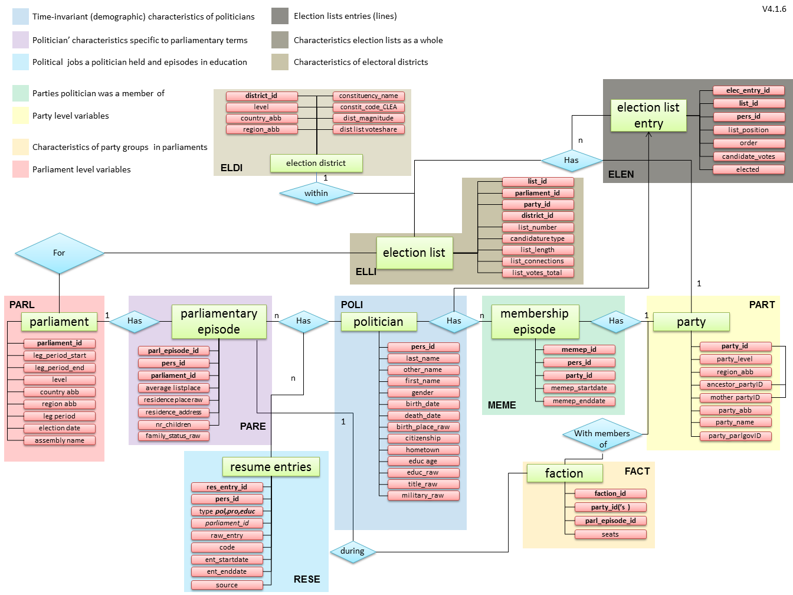

# PCC — Parliaments Day-by-Day

**Who was in what parliament, when.**

PCC (*Parliamentary Careers in Comparison*) is a dataset of parliamentary membership and political careers in several countries, designed to reconstruct careers **day by day** where the sources provide sufficient date detail. It links parliamentary mandates, party memberships, factions, committees, electoral candidacies, education, and other career entries. Coverage varies by country, chamber, period, and type of career information.

- Website: [parliamentarycareersincomparison.org](https://parliamentarycareersincomparison.org/)
- Data dictionary and coding conventions: [`pcc_codebook/PCC_codebook.md`](pcc_codebook/PCC_codebook.md)
- Found a data issue? [Open a GitHub issue](https://github.com/TomasZwinkels/PCCdata/issues), including the country, affected IDs, and data version

## Data at a glance

| | |
|---|---|
| Core countries | Switzerland, Germany, Netherlands, Norway, Canada |
| Additional holdings | Ireland and United Kingdom (Scotland), with older coverage |
| Parliamentary terms | 980 rows in `PARL.csv`, covering national and regional assemblies |
| Term-start years | 1867–2025 in `PARL.leg_period_start`; career entries also include observations in 2026 |
| Politicians | 88,129 rows in `POLI.csv` |
| Resume entries | 218,695 non-empty rows in `RESE.csv` |

These counts were checked on 24 September 2026 against the local files labelled `CSVexport_2026-9-18_16-5-37` in [`dataversion.txt`](dataversion.txt). `RESE.csv` contains 250,520 parsed rows in total, including 31,825 entirely empty rows; the headline count excludes those empty rows and does not deduplicate entry IDs. These are export counts, not counts of serving MPs.

| Coverage group | Country / area | Chambers represented in `PARL.csv` | Term-start years |
|---|---|---|---|
| Core | Switzerland | Nationalrat and Ständerat; 26 cantonal legislatures | 1911–2023 nationally; 1940–2019 cantonally |
| Core | Germany | Bundestag; 15 state legislatures (Brandenburg absent) | 1949–2025 nationally; 1946–2019 regionally |
| Core | Netherlands | Tweede Kamer | 1901–2025 |
| Core | Norway | Stortinget | 1913–2025 |
| Core | Canada | House of Commons | 1867–2025 |
| Additional holdings | Ireland | Dáil Éireann; Seanad Éireann | 1919–2020; 1922–2020, respectively |
| Additional holdings | Scotland (UK) | Scottish Parliament | 1999–2016 |

These ranges describe the earliest and latest `leg_period_start` years recorded in PARL. They are not end dates or guarantees of complete membership or career coverage between those years. Regional ranges combine multiple legislatures whose individual coverage differs. Check the relevant records, their sources, and the [issue tracker](https://github.com/TomasZwinkels/PCCdata/issues) before defining an analysis sample.

## Getting the data

Download and extract the repository using **Code → Download ZIP** on [GitHub](https://github.com/TomasZwinkels/PCCdata), or clone it:

```sh
git clone https://github.com/TomasZwinkels/PCCdata.git
cd PCCdata
```

Each root-level `.csv` file is one table. Run the R example below with the extracted or cloned `PCCdata` folder as your working directory. Important loading conventions:

- **Delimiter: `;`.** Quoted cells can themselves contain semicolons, including lists of IDs. Use a CSV reader that respects quoting.
- **Encoding: Windows-1252.** It differs from both UTF-8 and ISO-8859-1 (Latin-1).
- **IDs and codes: load as text**, preserving leading zeros and source identifiers.
- **Dates: load as text first.** The documented format is `03jan2025`, `jan2025`, or `2025`, with additional censoring notation described below. Some legacy values need further cleaning before parsing.
- **Text: transliteration is a coding convention, not a guarantee for this export.** Names are commonly transliterated (e.g. `ü` → `ue`), but accented text remains in tables including COMM, FACT, ORGS and PARE. The codebook also deliberately exempts source-ID, URL and external-title columns from transliteration; preserve those values.
- **Missing values:** empty strings and literal `NA`/`NC` values occur. Preserve them initially and interpret them using each variable's definition; a missing end date alone does not establish ongoing service.

In R:

```r
read_pcc <- function(file) {
  read.csv(file, sep = ";", fileEncoding = "Windows-1252",
           colClasses = "character", na.strings = character(),
           check.names = FALSE, stringsAsFactors = FALSE)
}

poli <- read_pcc("POLI.csv")
rese <- read_pcc("RESE.csv")

# Remove entirely empty rows from the loaded copy.
rese <- rese[rowSums(rese != "") > 0L, , drop = FALSE]

# Attach names to career entries, retaining entries without a POLI match.
stopifnot(!anyDuplicated(poli$pers_id))
careers <- merge(rese, poli[c("pers_id", "first_name", "last_name")],
                 by = "pers_id", all.x = TRUE, sort = FALSE)

readLines("dataversion.txt")
```

The example preserves raw date and missing-value notation; it does not yet select a parliamentary population or calculate daily membership. Some relationship fields contain multiple IDs separated by `;`: for example, `RESE.parliament_id` can contain `CA_NT-HC_1940;CA_NT-HC_1945`. Split those cells into individual references before joining to PARL, and account for the resulting repeated career entries in totals. Check key uniqueness and unmatched references when joining other tables.

For reproducibility, retain the exact CSV files used, record `dataversion.txt`, and, for a Git checkout, record `git rev-parse HEAD` and any local data changes. The export timestamp alone does not identify later corrections. With a ZIP download, record the source commit or archive URL and keep the downloaded archive.

### Dates and parliamentary counts

- RESE start and end dates are **inclusive**. Parliamentary spells follow the codebook's [mandate and date-boundary conventions](pcc_codebook/PCC_codebook.md#res_entry_start); `PARL.day_of_first_session` is a separate descriptive date.
- Partial dates retain the precision supplied by the source. Do not silently turn a year or month into an exact day.
- `[[lcen]]` means “at least since” and `[[rcen]]` means “at least until”; these mark uncertain boundaries. This export also uses the single-bracket spelling `[rcen]` in some PARL end dates. `res_entry_at` records observations at particular dates when exact spell boundaries are unknown. See the [date definitions](pcc_codebook/PCC_codebook.md#res_entry_end).
- PARE includes candidates as well as members. `member_ofthisparliament_atsomepoint` distinguishes membership during a term; use RESE parliamentary membership spells for dated service.
- Default parliamentary totals count **voting members**: exclude seated non-voting/observer entries (`pf_position = "11"`) and reserve-deputy status (`"10"`). A reserve deputy may have a separate seated spell; serving substitutes (`"09"`) count while exercising a voting mandate. First select the relevant parliamentary membership entries and dates; excluding `"10"` and `"11"` from all career entries is not a membership filter. [`PARL.parliament_size`](pcc_codebook/PCC_codebook.md#parliament_size) measures voting-seat capacity, which may exceed occupancy because of vacancies and may change within a term.

## Data structure

The data is organized into linked tables. For example, POLI stores a person's name and birth date, while RESE holds their career entries and links back to POLI through `pers_id`.



| File | Data frame | One line in this table is... |
|---|---|---|
| `POLI.csv` | Politician | one politician's person-level characteristics (name, birth date, gender, ...) |
| `PARE.csv` | Parliamentary episode | one person–parliamentary-term association, including unsuccessful candidates; not a dated service spell |
| `RESE.csv` | Resume entries | one career entry: political office, professional experience, education, occupational identity, or another biographical episode |
| `MEME.csv` | Membership episode | one spell of party membership for one politician |
| `PART.csv` | Party | one party record, including identifiers, names and episode dates |
| `FACT.csv` | Faction | one episode of a parliamentary party group, with dates and composition; a `faction_id` can recur across episodes |
| `COMM.csv` | Committee | one dated configuration of a parliamentary committee, delegation, or cross-party group |
| `PARL.csv` | Parliament | one legislative term of one national or regional assembly |
| `ELEC.csv` | Election | one election (including by-elections and second rounds), at district level |
| `ELLI.csv` | Electoral list | one candidate list put forward in one district for one election |
| `ELEN.csv` | Electoral list entry | one candidacy of one politician on one list |
| `ELDI.csv` | Electoral district | one constituency, for one parliamentary term |
| `ORGS.csv` | Organisations | one interest group / outside organisation a politician was affiliated with |
| `QUOT.csv` | Quota module | one dated party-level quota episode, identified by `quot_ep_id` and linked through `party_id` |
| `MINE.csv` | Ministerial episode | one ministerial person–parliament link; the current Dutch-only table has `min_episode_id`, `pers_id`, and `parliament_id`, without spell dates |

Use the codebook for detailed definitions and coding rules. Some sections and the diagram describe an older schema: for example, the QUOT section describes faction-level links, while this export has dated party-level episodes, and MINE is not documented there. Inspect the CSV headers for the columns actually supplied; the codebook is not a complete schema specification for this export.

## Data sources

PCC combines official parliamentary records, national statistical/biographical registers, and secondary academic sources, country by country:

- **Switzerland** — the Swiss Parliamentary Services' official OData web service ([ws.parlament.ch](https://ws.parlament.ch)), plus Swiss yearbooks for historical coverage.
- **Germany** — German Bundestag open data (official *Stammdaten* biographical register, [bundestag.de/services/opendata](https://www.bundestag.de/services/opendata)), historical yearbooks and biographical handbooks. POLI also includes identifiers for Philip Manow's Bundestag dataset.
- **Netherlands** — [parlement.com](https://www.parlement.com), the website of the Dutch Parliamentary Documentation Centre (PDC). Some entry-level source notes also document checks against official Tweede Kamer records.
- **Norway** — the Storting's official [Open Data API](https://data.stortinget.no/).
- **Canada** — ParlInfo, the Library of Parliament's public parliamentarian database ([lop.parl.ca](https://lop.parl.ca)).
- **Ireland and Scotland** — the older holdings include entries sourced from the Oireachtas Open Data APIs and Scottish Parliament Public APIs, respectively.

Some fields are enriched from Wikidata (e.g. birth dates and external identifiers). For the provenance of individual career entries, inspect `RESE.res_entry_source`, which contains source names and, in some cases, extraction dates or correction notes; it is not populated for every row. POLI's `id_[country]_*` columns link people to external systems but do not establish the source of every field or entry. See the codebook's [Data Sources](pcc_codebook/PCC_codebook.md#data-sources) and [ORGS secondary-source notes](pcc_codebook/PCC_codebook.md#secondary-source-variables) for further context. The source overview does not imply that every record has been checked against every listed source.

## License

This dataset is released under the **[Creative Commons Attribution-NonCommercial 4.0 International license (CC BY-NC 4.0)](LICENSE)**.

You may share and adapt the data for **non-commercial purposes**, with appropriate attribution, a link to the license, and an indication of any changes. See [LICENSE](LICENSE) and the [official CC BY-NC 4.0 deed](https://creativecommons.org/licenses/by-nc/4.0/) for the terms. Contact the PCC project team about permission for commercial use.

### How to cite

If you use this data in published or public-facing work, please cite:

> Turner-Zwinkels, T., Huwyler, O., Frech, E., Manow, P., Bailer, S., Goet, N. D., & Hug, S. (2022). Parliaments day-by-day: A new Open Source database to answer the question of who was in what parliament, party, and party-group, and when. *Legislative Studies Quarterly*, 47(3), 761–784. https://doi.org/10.1111/lsq.12359

```bibtex
@article{turnerzwinkels2022pcc,
  title   = {Parliaments day-by-day: A new Open Source database to answer the question of who was in what parliament, party, and party-group, and when},
  author  = {Turner-Zwinkels, Tomas and Huwyler, Oliver and Frech, Elena and Manow, Philip and Bailer, Stefanie and Goet, Niels D. and Hug, Simon},
  journal = {Legislative Studies Quarterly},
  volume  = {47},
  number  = {3},
  pages   = {761--784},
  year    = {2022},
  doi     = {10.1111/lsq.12359}
}
```

DOI: https://doi.org/10.1111/lsq.12359

Machine-readable citation metadata is available in [`CITATION.cff`](CITATION.cff). Also identify the data version and snapshot used, as described above.
